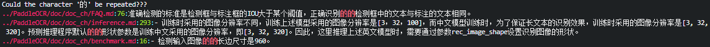

<!--
 * @Author: Shuangchi He / Yulv
 * @Email: yulvchi@qq.com
 * @Date: 2022-04-10 23:50:20
 * @Motto: Entities should not be multiplied unnecessarily.
 * @LastEditors: Shuangchi He
 * @LastEditTime: 2022-05-24 22:16:57
 * @FilePath: /Search-for-Typos/README.md
 * @Description: Search for typos in code or text.
 * Repository: https://github.com/Yulv-git/Search-for-Typos
-->

<h1><center> Search for Typos </h1></center>

    Search for typos in code or text. 查找文本或代码中的拼写错误/打字错误。

---

- [1. Features](#1-features)
  - [1.1. repeated English words](#11-repeated-english-words)
  - [1.2. repeated Chinese characters](#12-repeated-chinese-characters)
  - [1.3. typos of English words/strings](#13-typos-of-english-wordsstrings)
  - [1.4. wrong Chinese phrases](#14-wrong-chinese-phrases)
  - [1.5. wrong English phrases](#15-wrong-english-phrases)
- [2. Using](#2-using)
- [3. Search Results](#3-search-results)

---

### 1. Features

Currently, typos lookup for non-binary files (text files such as .txt and .md, code script files such as .py and .c) are supported. The typos lib is extensible and customizable, and supports regular expressions.

#### 1.1. repeated English words

Eg: `do`, see [repeated_English_words.txt](./typos_lib/repeated_English_words.txt) for more examples.

#### 1.2. repeated Chinese characters

Eg: `的`, see [repeated_Chinese_characters.txt](./typos_lib/repeated_Chinese_characters.txt) for more examples.

#### 1.3. typos of English words/strings

Eg: `modle`, see [typos_English_words_strings.txt](./typos_lib/typos_English_words_strings.txt) for more examples.

#### 1.4. wrong Chinese phrases

Eg: `既使`, see [wrong_Chinese_phrases.txt](./typos_lib/wrong_Chinese_phrases.txt) for more examples.

#### 1.5. wrong English phrases

Eg: `reasoning framework`, see [wrong_English_phrases.txt](./typos_lib/wrong_English_phrases.txt) for more examples.

### 2. Using

Search all text under the specified directory and its subdirectories for typos.

``` bash
# Search typos in all files under the ./ folder and its subfolders.
bash ./search_typos.sh ./

# Search typos in all files under the ./ folder and its subfolders exclude typos_lib folder.
bash ./search_typos_exclude_dir.sh ./ typos_lib/

# Search typos in all files under the ./ folder and its subfolders exclude README.md file.
bash ./search_typos_exclude.sh ./ README.md

# Search typos in all files under the ./ folder and its subfolders exclude typos_lib folder and README.md file.
bash ./search_typos_exclude_dir_exclude.sh ./ typos_lib/ README.md
```

### 3. Search Results

Some examples of search results are as follows:





---

<font size=4><b><big> Contributing </b></big></font>

Feel free to create issues or PRs if you have any questions or suggestions.
