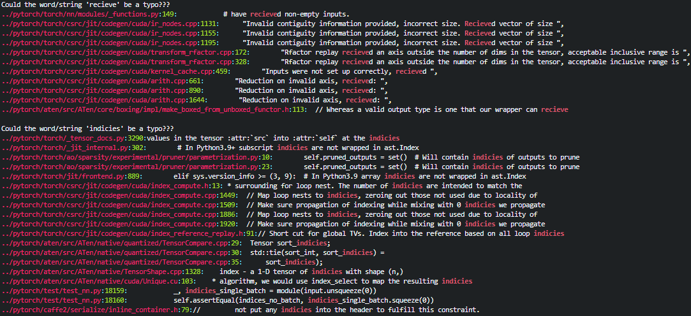

<!--
 * @Author: Shuangchi He / Yulv
 * @Email: yulvchi@qq.com
 * @Date: 2022-04-10 23:50:20
 * @Motto: Entities should not be multiplied unnecessarily.
 * @LastEditors: Shuangchi He
 * @LastEditTime: 2022-04-23 10:23:57
 * @FilePath: /Search-for-Typos/README.md
 * @Description: Search for typos in code or text.
 * Repository: https://github.com/Yulv-git/Search-for-Typos
-->

<h1><center> Search for Typos </h1></center>

    Search for typos in code or text.

---

- [1. Features](#1-features)
  - [1.1. repeated English words](#11-repeated-english-words)
  - [1.2. repeated Chinese characters](#12-repeated-chinese-characters)
  - [1.3. typos of English words/strings](#13-typos-of-english-wordsstrings)
  - [1.4. wrong Chinese phrases](#14-wrong-chinese-phrases)
  - [1.5. wrong English phrases](#15-wrong-english-phrases)
- [2. Using](#2-using)
- [3. Search Results](#3-search-results)

---

# 1. Features

Currently, only some typos are supported. Also, binary text are not supported.

## 1.1. repeated English words
  
    ``` bash
    ("do" "does" "have" "is" "are" \
    "of" "for" "in" "on" "at" "to" "with" "from" \
    "a" "an" "the" \
    "this" \
    "one"
    )
    ```

## 1.2. repeated Chinese characters

    ``` bash
    ("的" "是" "不" "就" "我" "他" "为" \
    "、" "，" "；" "：" "。"
    )
    ```

## 1.3. typos of English words/strings

    ``` bash
    ("modle" \
    "achive" "attrbute" "recieve" "indicies" "instrution" "occurences" "atleast" "ouput" "retrive" \
    "seperate" "humerous" "acheive" "accross" "agressive" "appearence" "enviroment" "fourty" "futher" \
    "goverment" "neccessary" "occured" "succesful" "truely" "expriment" "traing" "chanel" "toturial" \
    "arguement" "begining" "comming" "costom" "probabilites"
    )
    ```

## 1.4. wrong Chinese phrases
  
    ``` bash
    ("既使" "即然" \
    "讲会" "讲按照" "预料库" \
    "[想向象][^、，；：。\s][一那这]样" ".[副辐付附]图"
    )
    ```

## 1.5. wrong English phrases

    ``` bash
    ("reasoning_framework"
    )
    ```

# 2. Using

Search all text under the specified directory and its subdirectories for typos.

``` bash
bash ./search_typos.sh ./
```

# 3. Search Results

Some examples of search results are as follows:



